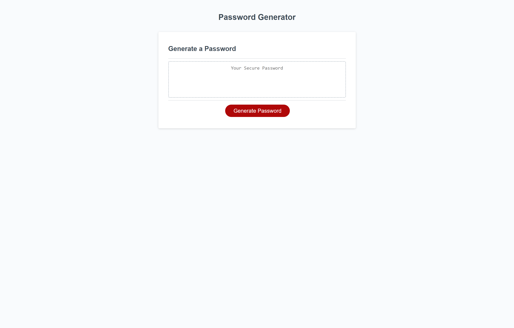

# random-password-generator

## Descripion

For this project I had starter code that I needed to make the JavaScript to make a randomly generated password. It needed to have the possibility to have numbers, uppercase letters, lowercase letters, and/or symbols. Through the use of prompts confirms and alerts I then had the information I needed to make the function generate the password to display for the end user.

## technologys

The webpage uses HTML and CSS and JavaScript

## Task

GIVEN I need a new, secure password
WHEN I click the button to generate a password
THEN I am presented with a series of prompts for password criteria
WHEN prompted for password criteria
THEN I select which criteria to include in the password
WHEN prompted for the length of the password
THEN I choose a length of at least 8 characters and no more than 128 characters
WHEN asked for character types to include in the password
THEN I confirm whether or not to include lowercase, uppercase, numeric, and/or special characters
WHEN I answer each prompt
THEN my input should be validated and at least one character type should be selected
WHEN all prompts are answered
THEN a password is generated that matches the selected criteria
WHEN the password is generated
THEN the password is either displayed in an alert or written to the page

## Struggles and what i learned 

 The biggest struggle that I ran into during this project was understanding how the expression to randomly pick a value out of an array worked. By breaking it down into its smaller parts I learned exactly what was happening and why it does what it does. 

## Usage
If you click on Generate Password it will start some popup that you will answer. Follow the prompts and after the webpage will display a randomly generated password.

## Webpage
https://hayessea000.github.io/random-password-generator/

